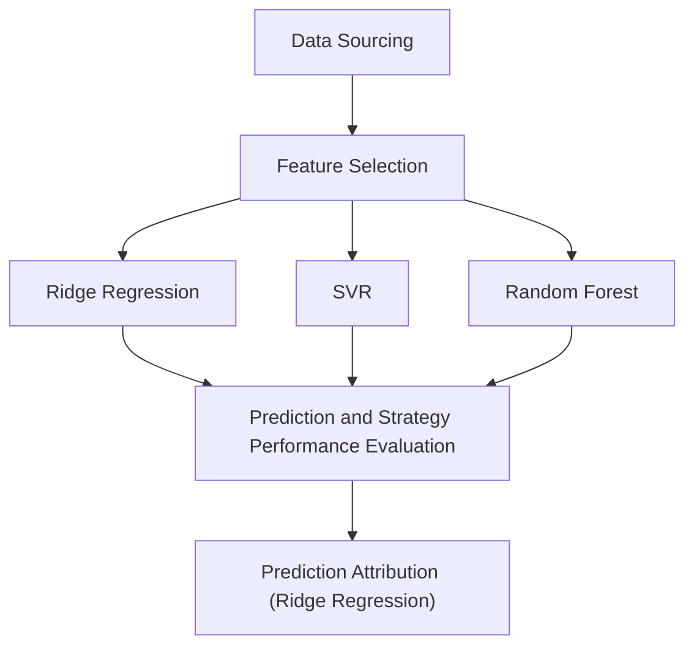

# S&P500 Index Long-Short Trading Strategy
In this project, we selected eight factors for predicting S&amp;P 500 index' next-month returns with Lasso Regression and variance inflation factor (VIF). Then we applied Ridge Regression, Support Vector Regression (SVR). and Random Forest respectively for return prediction and achieved **70.37%, 61.73%, and 65.43%** accuracy in return direction prediction. Based on the prediction results, three long-short trading strategy for S&P 500 Index were built and backtested, and the performance of the strategies and S&P 500 Index in time-series are shown in Figure 1.

Please notice that this project is for demonstration only and does not provide any investment advice.  
All data and code are available at [this repository](https://github.com/michaelli99/1.S-P500-Index-Long-Short-Strategy) for replication purpose.  
The following content is divided into five parts to demonstrate the process and performance of the prediction models, and the project's workflow is shown by the following diagram:

## 1. Data Sourcing
In this project, we sourced all the data from online databases such as Yahoo Finance and FRED. All the indices and factors’ raw data falls into the period of July 1990 to December 2023.

### 1.1. Response/target variable:  
The target varialble of prediction is **S&P 500 Index's next intra-month log returns**. The intra-month log return is calculated with the formula: $$y_i = log(\frac{P_{close, i}}{P_{open, i}})$$

We chose to use log return because of its potential of being normally distributed, and we used intra-month return so that the prediction can be transformed into actionable trading signal.
   
### 1.2. Predictors/independent variables:  
To predict the target variable, we first build a pool of candidate regressors with raw predictors data and basic mathematical transformation. The raw data can be classified into three categories: **economic, fundamental, and technical data**. Below is a short description for each category.
- Economic data includes macroeconomic indicators such as CPI components, employment statistics, and interest rates. Most of them are related to monetary policy.
- Fundamental data consists of valuation data for S&P 500 Index such as earnings, PE, and dividend yield.
- Technical data is sourced from S&P 500 Index and VIX's historical price and trading volume.

After sourcing the data, we converted all factors data into monthly basis. Then we moved historical data to the actual data release month to prevent data leakage. Finally,  all response and predictors' monthly data are available from July 1990 to December 2023 with a total of 402 months.

## 2. Feature Engineering
## 3. Models Training and Testing
## 4. Prediction and Strategy Performance Evaluation
## 5. Prediction Attribution (Ridge Regression Only)
