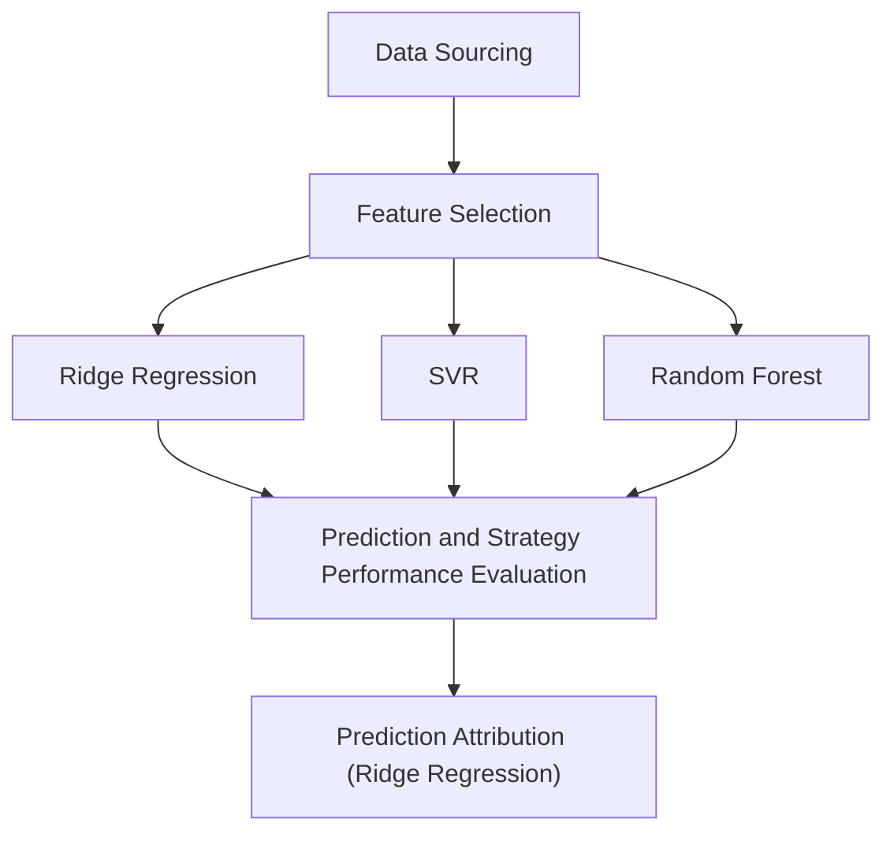

# S&P500 Index Long-Short Trading Strategy
In this project, we used Lasso Regression, t-score, and VIF and selected eight factors for predicting S&amp;P 500 index' next-month returns. Then we applied Ridge Regression, Support Vector Regression (SVR). and Random Forest respectively and achieved 70.37%, 61.73%, and 65.43% accuracy in return direction prediction. Based on the prediction results, three long-short trading strategy for S&P 500 Index were built and backtested, and the performance of the strategies and S&P 500 Index in time-series are shown in Figure 1.

The following content is divided into four parts to elaborate  
All data and code are available at this repository for replication purpose.  
Please notice that this project is for demonstration only and does not provide any investment advice.

## Workflow

## 1. Data Sourcing
## 2. Feature Engineering
## 3. Models Training and Testing
## 4. Prediction and Strategy Performance Evaluation
## 5. Prediction Attribution (Ridge Regression Only)
