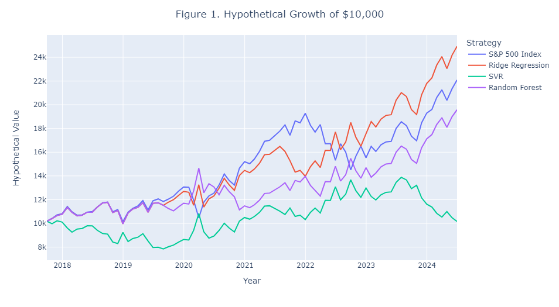

# S&P500 Index Long-Short Trading Strategy
In this project, we selected eight factors for predicting S&amp;P 500 index' next-month returns with Lasso Regression and variance inflation factor (VIF). Then we applied Ridge Regression, Support Vector Regression (SVR). and Random Forest respectively for return prediction and achieved 70.37%, 61.73%, and 65.43% accuracy in return direction prediction. Based on the prediction results, three long-short trading strategy for S&P 500 Index were built and backtested, and the performance of the strategies and S&P 500 Index in time-series are shown in Figure 1.

Please notice that this project is for demonstration only and does not provide any investment advice. All data and code are available at [this repository](https://github.com/michaelli99/1.S-P500-Index-Long-Short-Strategy) for replication purpose.  
The following content is divided into five parts to demonstrate the process and performance of prediction models. The project workflow is shown by the following diagram:

## 1. Data Sourcing
## 2. Feature Engineering
## 3. Models Training and Testing
## 4. Prediction and Strategy Performance Evaluation
## 5. Prediction Attribution (Ridge Regression Only)
