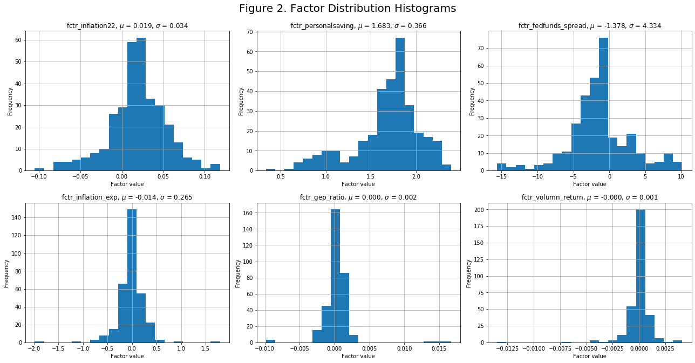
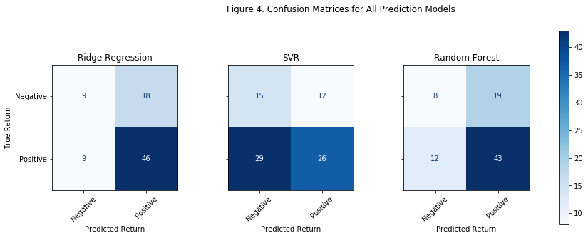

Skip to content
Navigation Menu
michaelli99
/
1.SP500-Index-Return-Prediction

Type / to search

Code
Issues
Pull requests
Actions
Projects
Security
Insights
Settings
Files
Go to file
t
plots
README.md
functions_demo.py
research_demo.ipynb
tbmpx1px5.csv
Editing README.md in 1.SP500-Index-Return-Prediction
Breadcrumbs1.SP500-Index-Return-Prediction
/
README.md
in
main

Edit

Preview
Indent mode

Spaces
Indent size

4
Line wrap mode

Soft wrap
Editing README.md file contents
Selection deleted
60
61
62
63
64
65
66
67
68
69
70
71
72
73
74
75
76
77
78
79
80
81
82
83
84
85
86
87
88
89
90
91
92
93
94
95
96
97
98
99
100
101
102
103
104
105
106
107
108
109
110
111
112
113
114
115
116
117
118
119
120
121
122
123
124
125
126
127
128
129
130
# S&P500 Index Return Direction Prediction
    - The maximum depth of the tree.
    - The minimum number of samples required to split an internal node.
    
We applied a 5-split time-series cross validation to the training set to derive the best hyperparameters for each prediction model. After getting the best hyperparameters for each model, we used thees hyperparameters in the testing set to predict for the target variable.

### 2.1.2 Testing Set
In the testing set, we used training set's best hyperparameters and scalars, and we adopted one-step ahead prediction. In other words, we trained each model with all available historical data up to the current month when predicting for next month's return.  

## 3. Feature Engineering
Raw predictors' data were transformed into 32 candidate regressors using basic mathematical operations (taking logarithm, month-over-month return, yoy return, or etc.). After the transformation, we applied a two-step factor selection process to select the most significant regressors for predicting the target variable:
- **Step1: Select up to 5 regressors from each sub-category using Lasso regression.**
- **Step2: Select the most significant regressors from all categories based on t-score and variance inflation factor (VIF) thresholds.**

After the above two steps, 6 regressors were selected, and their summary statistics are shown below:

The selected 6 regressors consist of 4 macroeconomic factors (fctr_inflation22, fctr_personalsaving, fctr_fedfunds_spread, and fctr_inflation_exp), 1 fundamental factor (fctr_gep_ratio), and 1 technical factor (fctr_volumn_return). All regressors are continuous variables. The distribution and time series plots for the selected regressors are shown below: 

The following prediction models are generally based on the assumption that the 6 selected factors' association with S&P 500 Index's next month return will not change.

## 4. Performance Evaluation
In this project, we applied three different machine learning models, **Ridge Regression, Support Vector Regression, and Random Forest**, to predict the index's next intramonth return. When predicting for next month's return, we use all available data up to the current month to retrain each model. For example, to predict May 2017's intramonth return, we will use the available data from July 1990 to April 2017. An alternative method would be using a fixed rolling window to retrain the models, which may reduce the noise from deep historical data and maintain the effectiveness of hyperparameters. However, we chose to use all historical data up to the date because we want to maximize the value of historical data.

After training the model and collecting the prediction results, we evaluated three prediction models from two perspectives: **prediction performance and trading strategy's performance**.

### 4.1. Prediction Performance Analysis
In prediction performance analysis, we evaluate each model's performance based on their **precision** and **recall**, and we also calculated the **accuracy** and **F1 score** for each model. We use the following formulas to calculate the precision, recall, accuracy, and F1 score:

$TP = True\ positive$

$FP = False\ positive$

$TN = True\ negative$

$FN = False\ negative$

$precision(P) = \frac{TP}{(TP+FP)}$

$recall(R) = \frac{TP}{(TP+TN)}$

$Accuracy = \frac{TP+TN}{(TP+FP+TN+FN)}$

$F1\ score = \frac{2 \times P \times R}{(P+R)}$

We summarized each model's prediction accuracy, precision, recall and F1 score in the dataframe.

We also used scatterplots and histograms to visualize the predicted values and prediction errors.

From the above summary statistics table and plots, we have the following observations for each prediction model:
#### 4.1.1. Ridge Regression
**The return direction prediction results based on Ridge Regression achieved the highest accuracy (67.90%), precision (71.88%), recall (85.19%), and F1 score (0.7797) across all three models.** The highest precision suggests that the model has the highest probability of being correct when it is predicting a positive return, and the highest recall signifies that the model is most likely to be correct given the positive actual return. The highest accuracy indicates that Ridge Regression's prediction has the highest overall prediction performance. This can also be observed from Figure 4 where Ridge Regression has the largest total counts in Quadrants II and IV of the confusion matrix.    
Ridge Regression also has the highest probablity of being correct when predicting negative returns based on the fact that it was correct in 9 out of 17 total negative return predictions. Additionally. Ridge Regression also has the lowest prediction bias with a mean squared error (MSE) of 0.0026 as shown in the above dataframe. Therefore, the prediction results of Ridge Regression had the best performance across all three models in both precision and recall.

#### 4.1.2. SVR
**SVR model has the second best precision (69.81%) and the lowest recall (68.52%) among all three models.** SVR also has the lowest prediciton direction accuracy (59.26%) and the highest MSE (0.0028) among all three models, suggesting that the model is underperforming. The prediction results of SVR are determined by the "support vectors", which tend to be the more extreme data points or outliers. This will cause the model to be more sensitive to the outliers and to generate more extreme predictions. From the confusion matrices in Figure 4, we can observe that SVR predicted more negative returns than the other two models, possibly because negative returns (tail risk) are usually more extreme and more likely to become the "support vectors". From Figure 5, we can also observe that SVR's predictions are more dispersed compared with Ridge and Random Forest's prediction results.

Use Control + Shift + m to toggle the tab key moving focus. Alternatively, use esc then tab to move to the next interactive element on the page.
No file chosen
Attach files by dragging & dropping, selecting or pasting them.
Editing 1.SP500-Index-Return-Prediction/README.md at main · michaelli99/1.SP500-Index-Return-Prediction
