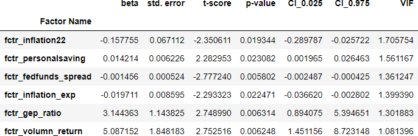

# S&P500 Index Long-Short Trading Strategy
In this project, we selected 8 factors for predicting S&P 500 index' next-month returns with Lasso Regression and variance inflation factor (VIF). Then we applied Ridge Regression, Support Vector Regression (SVR). and Random Forest respectively for return prediction and achieved **70.37%, 61.73%, and 65.43%** accuracy in return direction prediction. Based on the prediction results, three long-short trading strategy for S&P 500 Index were built and backtested, and the performance of the strategies and S&P 500 Index in time-series are shown in Figure 1.

**Please notice that this project is for demonstration only, and it does not provide any investment advice.**  
All data and code are available at the [repository](https://github.com/michaelli99/1.S-P500-Index-Long-Short-Strategy) for replication purpose.  
The following content is divided into five parts to demonstrate the process and performance of the prediction models, and the project's workflow is shown by the following diagram:

## 1. Data Sourcing
In this project, we sourced all the data from online databases such as Yahoo Finance and FRED. All the indices and factors’ raw data falls into the period of July 1990 to December 2023.

### 1.1. Response/target variable:  
The target varialble of prediction is **S&P 500 Index's next intra-month log returns**. The intra-month log return in month i is calculated with the formula: $$y_i = log(\frac{P_{close, i}}{P_{open, i}})$$
We chose to use log return because of its potential of being normally distributed, and we used intra-month return so that the prediction can be transformed into actionable trading signal.
   
### 1.2. Predictors/independent variables:  
To predict the target variable, we first built a pool of candidate regressors with raw predictors data and basic mathematical transformation. The raw data can be classified into three categories: **economic, fundamental, and technical data**. Below is a short description for each category.
- Economic data includes macroeconomic indicators such as CPI components, employment statistics, and interest rates. Most of them are related to monetary or fiscal policy.
- Fundamental data consists of valuation data for S&P 500 Index such as earnings, PE, and dividend yield.
- Technical data was derived from S&P 500 Index and VIX's historical price and trading volume.

After sourcing the data, we converted all factors data into monthly basis. Then we moved historical data to the actual data release month to prevent data leakage. Finally, all response and predictors' monthly data are available from July 1990 to December 2023 with a total of 402 months.

## 2. Feature Engineering
Raw predictors' data were transformed into 35 candidate regressors using basic mathematical operations. After factor transformation, we applied a two-step factor selection process to select the most significant regressors for predicting the target variable:
- Step1: Select up to 5 regressors from each sub-category using Lasso regression.
- Step2: Select the most significant regressors from all categories based on t-score and variance inflation factor (VIF) thresholds.

After the two above steps, 8 regressors were selected from the feature engineering process. The 8 selected regressors consist of 5 macroeconomic factors, 1 fundamental factor, and 2 technical factors. All factors are continuous variables except for EWMA_Cross_Ind1, which is a binary variable that only takes value from 1 and 0. The summary statistics for the 8 selected regressors is shown below:

All of the following prediction models are based on the assumption/prior of **the 8 selected factors' association with S&P 500 Index's next month return is not changed**.

## 3. Models Training and Testing

To predict the target variable, we applied three different machine learning models: **Ridge Regression, Support Vector Regression (SVR), and Random Forest**.

The data were divided into training and testing set with the classic 80-20 split. The original sequece of the data was maintained, and we adopted one-month ahead prediction in the testing set.

### 3.1. Training set
Training set data spans from 1990-07-31 to 2017-03-31 with a total of 321 data points. In the training set, we derived the best hyperparameters for each prediction model. Additionally, since there were regularization/penalization components in ridge regression and support vector regression models, regressors had to be standardized/normalized to achieve equal importance in the prediction. Hence the training set was also used to derive the nomralization scalar.  
Below is a summary of hyperparameters that were derived from the trainings set:
- Ridge Regression:
    - Alpha: Constant that multiplies the L2 term, controlling regularization strength.
    - Normalization scalar: $\mu$ and $\sigma$.
- Support Vector Regression:
    - C: Regularization parameter that inversely relates to the strength of the regularization.
    - epsilon: The epsilon-tube within which no penalty is associated in the training loss function with points predicted within a distance epsilon from the actual value.
    - Normalization scalar: $\mu$ and $\sigma$.
- Random Forest:
    - The number of trees n.
    - The maximum depth of the tree.
    - The minimum number of samples required to split an internal node.
    
We applied a 5-split time-series cross validation to the training set to derive the best hyperparameters for each prediction model. After getting the best hyperparameters for each model, we used thees hyperparameters in the testing set to predict for the target variable.

### 3.2. Testing set

Testing set data spans from 2017-04-30 to 2023-12-31 with a total of 81 data points. In the testing set, we used training set's best hyperparameters and scalars, and we adopted one-step ahead prediction. In other words, we trained each model with all available historical data up to the current month when predicting for next month's return.  

## 4. Prediction and Strategy Performance Evaluation
## 5. Prediction Attribution (Ridge Regression Only)
