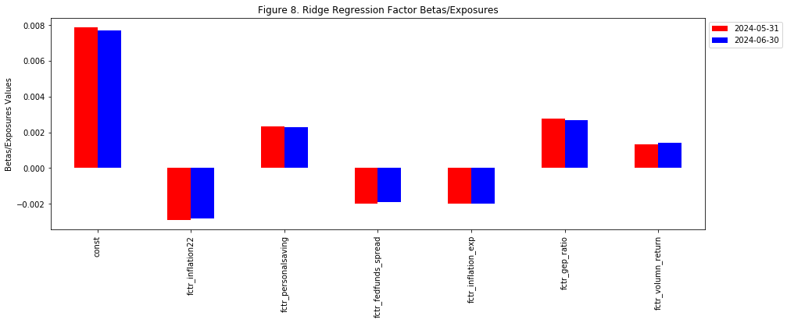
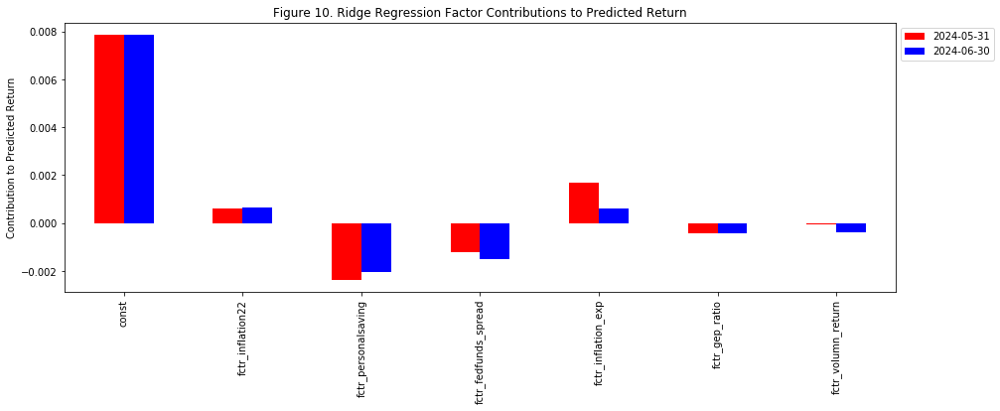

# S&P500 Index Return Direction Prediction
## Overview

In this project, we applied machine learning algorithms to **predict S&amp;P 500 index next-month return direction** using open-source economic and fundamental data. The best prediction model achieved a prediction accuracy of **67.07%** (Ridge Regression) in the out-of-sample test set (August 2017 to May 2024). The summary statistics of prediction performance are shown here.

For each prediction model, we built and backtested with a long-short trading strategy. Below is the hypothetical performance of the strategies.

The general workflow of the project can be demonstrated by the graph:

The following content is divided into five sections to elaborate the project's procedures and methodologies.

**Please notice that this project is for demonstration only and does not provide any investment recommendation.**  
All data and code are available at the [repository](https://github.com/michaelli99/1.S-P500-Index-Return-Prediction) for validation.  

## 1. Data Sourcing
In this project, all data was sourced from publicly available databases and fell into the period of January 1990 to June 2024.

### 1.1. Response/Target Variable:  
Our target variable is **the direction/sign of S&P 500 Index next intramonth return**. In the following content, we selected six facotr and applied three regression models to predict the index's next intra-month log return. Then we used the sign of the models' predicted return as our final prediction. The intra-month log return of month i is calculated by the formula: $$y_i = log(\frac{P_{close, i}}{P_{open, i}})$$
We chose to use log return because of its potential of being normally distributed, and we used intra-month return to avoid look-ahead bias. We chose to use regression models instead of classification models because we believe regression models can extract more information from the target variable. For example, both a -15% and a -1% return would be classified as negative returns and have the same penalty for being wrong in a classification problem, but regression models will distinguish between the two returns and penalize based on the deviations from the actual return.
   
### 1.2. Predictors/Independent Variables:  
To predict the target variable, we started from a pool of candidate factors which were derived from raw data using basic mathematical transformations. The raw data came from three categories: **economic data, fundamental data, and price data**. 
- Economic data include CPI components, employment statistics, interest rates, and consumer expectations. They were sourced from [FRED](https://fred.stlouisfed.org/) and [University of Michigan Surveys of Consumers](http://www.sca.isr.umich.edu/).
- Fundamental data include S&P 500 PE ratio and dividend yield and is sourced from https://www.multpl.com/.
- Price data include S&P 500 Index and VIX's historical price and trading volume and were derived from Yahoo Finance.

After sourcing the data, we converted all factor data into monthly basis. Then we shifted historical data to the actual data release month to prevent look-ahead bias. Finally, all response and predictors' monthly data are from July 1990 to June 2024 with a total of 407 months.

## 2. Train-test Split
After sourcing the data, we divided the dataset into training and testing set using a classic 80-20 split. **The training set spans from 1990-07-31 to 2017-07-31 with a total of 325 data points, while the testing set spans from 2017-08-31 to 2024-05-31 with a total of 82 data points.**

### 2.1.1 Training Set
The training set is used to select factors and derive the best hyperparameters for each prediction model. Additionally, since there were regularization/penalization components in Ridge regression and support vector regression models, regressors had to be standardized to achieve equal importance in the prediction. Hence, the training set was also used to derive the standardization scalar.  
Below is a summary of hyperparameters that were derived from the training set:
- **Ridge Regression:**
    - Alpha: Constant that is used to multiply the L2 term and control regularization strength.
    - Normalization scalar: $\mu$ and $\sigma$.
- **Support Vector Regression:**
    - C: Regularization parameter that inversely relates to the strength of the regularization.
    - epsilon: The epsilon-tube within which no penalty is associated in the training loss function with points predicted within a distance epsilon from the actual value.
    - Normalization scalar: $\mu$ and $\sigma$.
- **Random Forest:**
    - The number of trees n.
    - The maximum depth of the tree.
    - The minimum number of samples required to split an internal node.
    
We applied a 5-split time-series cross validation to the training set to derive the best hyperparameters for each prediction model. After getting the best hyperparameters for each model, we used these hyperparameters in the testing set to predict for the target variable.

### 2.1.2 Testing Set
In the testing set, we used training set's selected factors and best hyperparameters and predicted the target variable using a rolling-window one-step ahead prediction. The window length is set to be 80% of training set length, and we retrained prediction models with  up-to-date data when predicting for next month's return.  

## 3. Feature Engineering
Raw predictors' data were transformed into 32 candidate regressors using basic mathematical operations (taking logarithm, month-over-month return, or yoy return.). After the transformation, we applied a two-step factor selection process to select the most significant and orthogonal regressors.
- **Step1: Select up to 5 regressors from each sub-category using Lasso regression.**
- **Step2: Select the most significant regressors from all categories based on t-score and variance inflation factor (VIF) thresholds.**

After the above two steps, 6 regressors were selected, and their summary statistics are shown below:

The selected 6 regressors consist of 4 macroeconomic factors (fctr_inflation22, fctr_personalsaving, fctr_fedfunds_spread, and fctr_inflation_exp), 1 fundamental factor (fctr_gep_ratio), and 1 technical factor (fctr_volumn_return). All regressors are continuous variables. The distribution and time series plots for the selected regressors are shown below: 

The following prediction models are generally based on the assumption that the 6 selected factors' association with S&P 500 Index's next month return will not change.

## 4. Performance Evaluation
In this project, we applied three different machine learning models, **Ridge Regression, Support Vector Regression, and Random Forest**, to predict the index's next intramonth return. When predicting for next month's return, we use all available data up to the current month to retrain each model. For example, to predict May 2017's intramonth return, we will use the available data from July 1990 to April 2017. An alternative method would be using a fixed rolling window to retrain the models, which may reduce the noise from deep historical data and maintain the effectiveness of hyperparameters. However, we chose to use all historical data up to the date because we want to maximize the value of historical data.

After training the model and collecting the prediction results, we evaluated three prediction models from two perspectives: **prediction performance and trading strategy's performance**.

### 4.1. Prediction Performance Analysis
In prediction performance analysis, we evaluate each model's performance based on their **precision** and **recall**, and we also calculated the **accuracy** and **F1 score** for each model. We use the following formulas to calculate the precision, recall, accuracy, and F1 score:

$TP = True\ positive$

$FP = False\ positive$

$TN = True\ negative$

$FN = False\ negative$

$precision(P) = \frac{TP}{(TP+FP)}$

$recall(R) = \frac{TP}{(TP+TN)}$

$Accuracy = \frac{TP+TN}{(TP+FP+TN+FN)}$

$F1\ score = \frac{2 \times P \times R}{(P+R)}$

We summarized each model's prediction accuracy, precision, recall and F1 score in the dataframe.

We also used scatterplots and histograms to visualize the predicted values and prediction errors.

From the above summary statistics table and plots, we have the following observations for each prediction model:
#### 4.1.1. Ridge Regression
**The return direction prediction results based on Ridge Regression achieved the highest accuracy (67.90%), precision (71.88%), recall (85.19%), and F1 score (0.7797) across all three models.** The highest precision suggests that the model has the highest probability of being correct when it is predicting a positive return, and the highest recall signifies that the model is most likely to be correct given the positive actual return. The highest accuracy indicates that Ridge Regression's prediction has the highest overall prediction performance. This can also be observed from Figure 4 where Ridge Regression has the largest total counts in Quadrants II and IV of the confusion matrix.    
Ridge Regression also has the highest probablity of being correct when predicting negative returns based on the fact that it was correct in 9 out of 17 total negative return predictions. Additionally. Ridge Regression also has the lowest prediction bias with a mean squared error (MSE) of 0.0026 as shown in the above dataframe. Therefore, the prediction results of Ridge Regression had the best performance across all three models in both precision and recall.

#### 4.1.2. SVR
**SVR model has the second best precision (69.81%) and the lowest recall (68.52%) among all three models.** SVR also has the lowest prediciton direction accuracy (59.26%) and the highest MSE (0.0028) among all three models, suggesting that the model is underperforming. The prediction results of SVR are determined by the "support vectors", which tend to be the more extreme data points or outliers. This will cause the model to be more sensitive to the outliers and to generate more extreme predictions. From the confusion matrices in Figure 4, we can observe that SVR predicted more negative returns than the other two models, possibly because negative returns (tail risk) are usually more extreme and more likely to become the "support vectors". From Figure 5, we can also observe that SVR's predictions are more dispersed compared with Ridge and Random Forest's prediction results.

#### 4.1.3. Random Forest
**Random Forest ranked last in precision and second in recall.** Random Forest is based on ensembling decision trees, and it resulted in the most conservative prediction as all of the predicted values fall in the range (-0.02, 0.02) possibly because of the averaging effect of all trees.

#### 4.1.4. General Observation
All three models' precisions are greater than 65%, suggesting that any of the three models is more likely to be correct than wrong when it predicts a positive return. All the recalls are greater than 65%, indicating that all three models are more likely to be correct given the positive actual return. However, it is not surprising because S&P 500 Index seems to have positive drift in both train and test samples. Based on the Actual Return vs. Predicted Return plots in Figure 5, we can see that there is a cluster in Quadrants I of each plot, but it is not obvious that a strong association between the actual return and each model's predictions.

### 4.2. Strategy Performance Analysis
After collecting the prediction result from each model, we built a long-short trading strategy based on the signs of the predicted returns and backtested the strategy's performance.  
Suppose the strategy is implemented as follows:
- If the predicted return is positive, the strategy will take 100% long position on S&P 500 Index at market open of next month and close the position at market close.
- If the predicted return is negative, the strategy will take 100% short position on S&P 500 Index at market open of next month and close the position at market close.  

We ignored any implicit and explicit trasaction costs to simplify the calculation, and we used actual S&P 500 Index as benchmark and backtest all three strategies from 2017-05-01 to 2024-01-31 with a total of 81 months. The strategies's performance statistics and time-series plot are shown below:

**From the above dataframe, we can see that all three strategies has positive return in the 81-month backtest period.**  
**The strategy based on Ridge Regression prediction achieved the best annualized return of 14.54%. The strategy also has the best performance in terms of volatility, Sharpe ratio, maximum drawdown, Calmar ratio, 95% VaR, and win rate.** The Ridge regression strategy outperformed the long-only strategy most because of its performance in 2022, and the selected inflation and inflation expectation factors likely explain the model's correct prediction.    
**SVR strategy had a lagging 5.83% annualized return and the highest volatility of 19.57%. Additionally, the strategy has the worst performance in terms of maximum drawdown, Calmar ratio, 95% VaR, and win rate.** It is not surprising because SVR predicted more false negative returns according to the confusion matrices. However, the model has the best slugging.    
**Random Forest achieved a 8.27% annualized return and 19.48% volatility. It ranked second in annualized return, volatility, sharpe ratio, maximum drawdown, calmar ratio, and win rate.**    
From the following performance time-series plot, we can see that all three strategies attain positive returns in 2022 when the index dropped by 20%. This could be explained by two of the selected factors, fctr_inflation22 and fctr_inflation_exp, which are closely related to inflation and inflation expectation. Overall, we can conclude that our long-short trading strategies based on Ridge Regression achieved the best performance, and it is the only strategy that outperformed S&P 500 index. The strategy based on Random Forest predictions ranked second in most of the measures while the SVR strategy lagged behind.

## 5. Prediction Attribution (Ridge Regression)

One advantage of Ridge Regression is its simplicity. The predicted value of Ridge Regression can be written as: $$y = \beta^Tx = \beta_0 x_0 + \beta_1 x_1 + \cdots + \beta_n x_n$$  
With this formula, we can easily break down the predicted value into each factor's contribution to the predicted value. In the following graphs, we demonstrate this advantage of Ridge Regression using 2024-01-31 and 2024-02-29 as examples and compare the two month's exposures, factors' values, and factors' contribution to alpha side by side.

