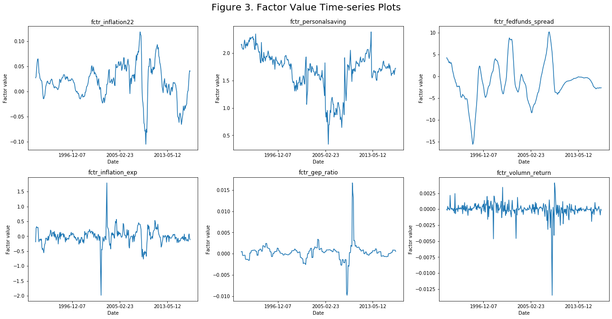
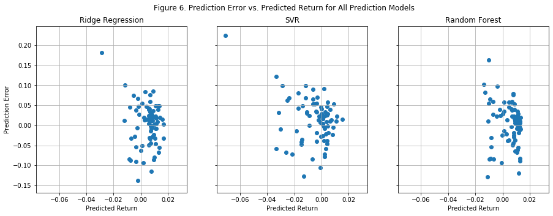
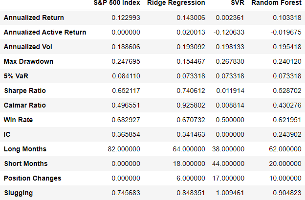
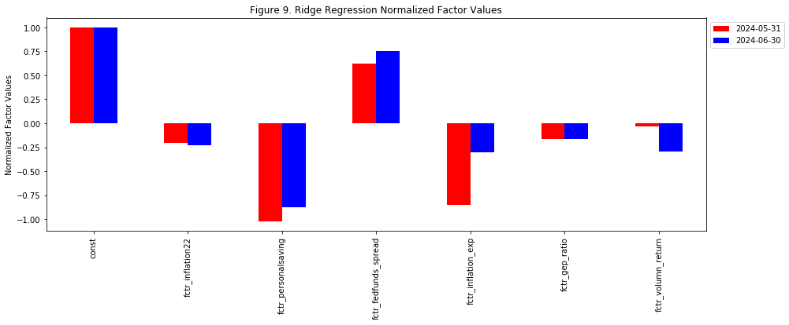

# S&P500 Index Return Direction Prediction
In this project, we applied multiple machine learning algorithms and economic data to **predict S&P 500 index's next-month return's direction**. Our best model achieved a prediction accuracy of **67.90%** (Ridge Regression) in an 81-month out-of-sample test set. The summary statistics for prediction performance are shown as follows:

Based on the prediction results, we also built and backtested three long-short trading strategy for S&P 500 Index, and the hypothetical performance of the strategies is compared with S&P 500 Index and shown below.

**Please notice that this project is for demonstration only, and it is not intended for any investment advice.**  
All data and code are available at the [repository](https://github.com/michaelli99/1.S-P500-Index-Return-Prediction) for replication purpose.  

The general workflow of the project can be demonstrated by the following diagram:

The following content is divided into five parts to explain the process and performance of the prediction models.

We collected economic, fundamental, and price data and selected 6 revelant factors using a **variance inflation factor (VIF)** threshold, a t-score threshold, and **LASSO Regression**. Then we applied **Ridge Regression, Support Vector Regression (SVR), and Random Forest** respectively for predicting the index return direction. 
## 1. Data Sourcing
In this project, we sourced all data from publicly available databases such as FRED and Yahoo Finance. All the indices and factors’ raw data falls into the period of July 1990 to February 2024.

### 1.1. Response/Target Variable:  
The target varialble of the regression models is **S&P 500 Index's next intramonth return direction**. In this project, we will apply regression models to predict the index's next intra-month log return and use the sign of the predicted return as the final prediction result. The intra-month log return of month i is calculated by the formula: $$y_i = log(\frac{P_{close, i}}{P_{open, i}})$$
We chose to use log return because of its potential of being normally distributed, and we used intra-month return for the trading strategy backtest purpose. We chose to use regression models instead of classification models because regression models can extract more information from the target variable. For example, both a -15% return and a -1% will be classified as negative returns and have the same penalty for false predictions in a classification problem, but regression models will distinguish between the two returns and penalize based on the deviations between predicted returns and actual returns.
   
### 1.2. Predictors/Independent Variables:  
To predict the target variable, we first built a pool of candidate regressors with raw predictors data and basic mathematical transformation. The raw data can be classified into three categories: **economic, fundamental, and technical data**. Below is a short description for each category.
- Economic data includes macroeconomic indicators such as CPI components, employment statistics, and interest rates. Most of them are related to monetary or fiscal policy and are sourced from [FRED](https://fred.stlouisfed.org/).
- Fundamental data consists of valuation data for S&P 500 Index such as earnings, PE, and dividend yield and is sourced from https://www.multpl.com/.
- Technical data was derived from S&P 500 Index and VIX's historical prices and trading volume.

After sourcing the data, we converted all factors data into monthly basis. Then we shifted historical data to the actual data release month to prevent data leakage. Finally, all response and predictors' monthly data are available from July 1990 to January 2024 with a total of 403 months.

## 2 Train-test Split
After sourcing the data, we divided the dataset into training and testing set with the classic 80-20 split. The original sequece of the data was maintained, and we adopted one-month ahead prediction in the testing set.

### 2.1.1 Training Set
**Training set data spans from 1990-07-31 to 2017-04-30 with a total of 322 data points.** We used the training set to select factors and derive the best hyperparameters for each prediction model. Additionally, since there were regularization/penalization components in ridge regression and support vector regression models, regressors had to be standardized/normalized to achieve equal importance in the prediction. Hence, the training set was also used to derive the nomralization scalar.  
Below is a summary of hyperparameters that were derived from the training set:
- **Ridge Regression:**
    - Alpha: Constant that multiplies the L2 term, controlling regularization strength.
    - Normalization scalar: $\mu$ and $\sigma$.
- **Support Vector Regression:**
    - C: Regularization parameter that inversely relates to the strength of the regularization.
    - epsilon: The epsilon-tube within which no penalty is associated in the training loss function with points predicted within a distance epsilon from the actual value.
    - Normalization scalar: $\mu$ and $\sigma$.
- **Random Forest:**
    - The number of trees n.
    - The maximum depth of the tree.
    - The minimum number of samples required to split an internal node.
    
We applied a 5-split time-series cross validation to the training set to derive the best hyperparameters for each prediction model. After getting the best hyperparameters for each model, we used thees hyperparameters in the testing set to predict for the target variable.

### 2.1.2 Testing Set
**Testing set data spans from 2017-04-30 to 2023-12-31 with a total of 81 data points.** In the testing set, we used training set's best hyperparameters and scalars, and we adopted one-step ahead prediction. In other words, we trained each model with all available historical data up to the current month when predicting for next month's return.  

## 2. Feature Engineering
Raw predictors' data were transformed into 32 candidate regressors using basic mathematical operations. After factor transformation, we applied a two-step factor selection process to select the most significant regressors for predicting the target variable:
- **Step1: Select up to 5 regressors from each sub-category using Lasso regression.**
- **Step2: Select the most significant regressors from all categories based on t-score and variance inflation factor (VIF) thresholds.**

After the two above steps, 6 regressors were selected from the feature engineering process. The summary statistics for the 6 selected regressors is shown below:

The 6 selected regressors consist of 4 macroeconomic factors (fctr_inflation22, fctr_personalsaving, fctr_fedfunds_spread, and fctr_inflation_exp), 1 fundamental factor (fctr_gep_ratio), and 1 technical factor (fctr_volumn_return). All regressors are continuous variables. The distribution and time series plots for the selected regressors are shown below: 

The following prediction models are generally based on the assumption/prior of the 6 selected factors' association with S&P 500 Index's next month return will not change.

To predict S&P 500 Index's next intramonth return, we applied three different machine learning models: **Ridge Regression, Support Vector Regression (SVR), and Random Forest**.

## 4. Performance Evaluation
After training the model and collecting the prediction results, we evaluated three prediction models from two perspectives: **prediction performance and trading strategy's performance**.

### 4.1. Prediction Performance Analysis
In prediction performance analysis, we evaluate each model's performance based on their **precision** and **recall**, and we also calculated the accuracy and F1 score for each model. We use the following formulas to calculate the precision, recall, accuracy, and F1 score:

$TP = True \ positive$
$precision (P) = \frac{TP}{(TP+FP)}$

We summarized each model's prediction accuracy, precision, recall and F1 score in the dataframe. 

We also used scatterplots and histograms to visualize the predicted values and prediction errors.

From the above summary statistics table and plots, we have the following observations for each prediction model:
#### 4.1.1. Ridge Regression
**The return direction prediction results based on ridge regression achieved the highest accuracy, precision, recall, and F1 score across all three models.** The highest accuracy indicates that ridge regression's prediction has the highest overall prediction performance. The highest precision suggests that when rigde regression generates positive prediction, it has the highest probability of being correct, and the highest recall signifies the model captures the among all actual positive returns.
indicate that SVR has the lowest prediction error squared on average. The lowest MSE achieved by SVR model can also be observed from Figure 5 where prediction errors of SVR are generally distributed closer to x-axis.  
**However, SVR also has the lowest prediciton direction accuracy (61.73%) among all three models.** The prediction direction accuracy is calculated by dividing the frequency of predicted return and actual return have the same sign by total count of prediction. In Figure 4, the prediction direction accuracy is the proportion of Quadrants II and IV's points in the whole plot. We can see that SVR has more points in Quardrant II than the other two prediction models. If we set negative predicted return as not rejecting the null hypothesis, this suggests that SVR has higher chance of being false negative (Type II error). However, we also notice that some of the misclassifed points from SVR are very close to x-axis. This can be explained by the hyperparameter of epsilon in SVR model. **The value of epsilon will define a margin of tolerance where no penalty is given to prediction errors within the margin, making the model ignore small prediction errors and assigning more extreme valuese as "support vectors". Compared with Ridge Regression and Random Forest, SVR is more robust to less extreme data points and performs better when predicting more extreme values.** In the strategy performance evaluation part, we also notice that SVR-based strategy results in better return performance despite the lowest prediciton direction accuracy (or "win ratio").  
**Ridge Regression ranks second in MSE and R-squared, and its performance in prediction errors is comparable with SVR.** This could be explained by the fact that we use linear kernel for SVR so that both Ridge Regression and SVR predictions are based on linear transformations of the regressors. From Figure 4, we can observe that Ridge Regression often gives more conservative predictions than SVR. This can be explained by a large regularization constant (alpha) derived from the training set and the hyperparameter epsilon in SVR which ignores small errors for SVR training.  
**Ridge Regression achieved the best 70.37% return direction prediction accuracy.** This can be observed from Figure 4 where Ridge Regression appears to have the most points in Quadrants I and III.  
Ridge Regression also has the lowest prediction bias with an average prediction error of 0.001 as shown in Figure 6.

#### 4.1.2. SVR
**SVR model achieved the lowest MSE (0.002267) and the highest R-squared (0.139177) among all three models.** Both MSE and R-squared statistics indicate that SVR has the lowest prediction error squared on average. The lowest MSE achieved by SVR model can also be observed from Figure 5 where prediction errors of SVR are generally distributed closer to x-axis.  
**However, SVR also has the lowest prediciton direction accuracy (61.73%) among all three models.** The prediction direction accuracy is calculated by dividing the frequency of predicted return and actual return have the same sign by total count of prediction. In Figure 4, the prediction direction accuracy is the proportion of Quadrants II and IV's points in the whole plot. We can see that SVR has more points in Quardrant II than the other two prediction models. If we set negative predicted return as not rejecting the null hypothesis, this suggests that SVR has higher chance of being false negative (Type II error). However, we also notice that some of the misclassifed points from SVR are very close to x-axis. This can be explained by the hyperparameter of epsilon in SVR model. **The value of epsilon will define a margin of tolerance where no penalty is given to prediction errors within the margin, making the model ignore small prediction errors and assigning more extreme valuese as "support vectors". Compared with Ridge Regression and Random Forest, SVR is more robust to less extreme data points and performs better when predicting more extreme values.** In the strategy performance evaluation part, we also notice that SVR-based strategy results in better return performance despite the lowest prediciton direction accuracy (or "win ratio").  

#### 4.1.3. Random Forest
**Random Forest ranked last in prediction error.** Random Forest is based on ensembling decision trees, and it results in the most conservative prediction as all of the predicted values fall in the range (-0.02, 0.02) possibly because of the averaging effect of all trees. The prediction R-sqaured of Random Forest is significantly lower than the R-squared of Ridge Regression and SVR, indicating that Random Forest's prediction is not very helpful in explaining the variation of the target variable.  
**Random Forest ranks second in prediction accuracy and first in positive prediction accuracy.** One advantage of Random Forest is that the model has a positive prediction accuracy of 75.56%, suggesting that Random Forest is most likely to be correct when it predicts the target variable to be positive.  

#### 4.1.4. General Observation
**The R-sqaured for all prediction models are less than 0.15, indicating that the majority of S&P 500 Index's returns are not explained by the models and selected factors.** This is not surprising because our factor universe is limited, and it is not expected to cover all factors that could explain S&P 500 Index's future return. Also, all factors data was based on historical events or expectations. Contingent events may happen during the target month of prediction and impact the index's return. It turns out that all the models achieved more than 60% of prediction direction accuracy with less than 0.15 R-squared.

### 4.2. Strategy Performance Analysis
After collecting the prediction result from each model, we built a long-short trading strategy based on the signs of the predicted returns and backtested the strategy's performance.  
Suppose the strategy is implemented as follows:
- If the predicted return is positive, the strategy will take 100% long position on S&P 500 Index at market open of next month and close the position at market close.
- If the predicted return is negative, the strategy will take 100% short position on S&P 500 Index at market open of next month and close the position at market close.  

We ignored any implicit and explicit trasaction costs to simplify the calculation, and we used actual S&P 500 Index as benchmark and backtest all three strategies from 2017-05-01 to 2024-01-31 with a total of 81 months. The strategies's performance statistics and time-series plot are shown below:

**From the dataframe, we can see that all three strategies outperformed the index in terms of annualized return, Sharpe ratio, Calmar ratio, and 95% VaR.**  
**The strategy based on SVR prediction outplays the index by 10.11% per annum. Furthermore, the strategy has the best performance in terms of annualized return, volatility, Sharpe ratio, maximum drawdown, Calmar ratio, and 95% VaR.** Although SVR has the lowest win ratio, it is the only strategy that has a slugging percentage greater than 1, which suggests that the winning months make more profit than the loss of lossing months on average.
**Ridge Regression achieves 19.38% annualized return and has similar performance to SVR.** However, the maximum drawdown of Ridge Regression strategy is 21.13%, which is 1.5 times of SVR's maximum drawdown. The maximum drawdown of Ridge Regression happens during the first quarter of 2020 when the market was volatile due to COVID and Ridge Regression mispredicts the return direction three times in a row.  
**Random Forest outperforms S&P 500 Index slightly and has comparable performance with the S&P 500 Index.** It has higher volatility and maximum drawdown but lower 95% VaR.  
From the following performance time-series plot, we can see that all three strategies attain positive returns in 2022 when the index dropped by 20%. This could be explained by the first two regressors which are derived from CPI components. However, if CPI and inflation are less associated with S&P 500 Index return in the future, the models' performance might not be as good as the backtest period.  
**Overall, we can conclude that our long-short trading strategies based on Ridge Regression and SVR achieve better performance than S&P 500 Index. Both Ridge Regression and SVR has better annualized return, Sharpe ratio, drawdown, Calmar ratio, and 95% VaR. Random Forest strategy does not have obvious outperformance. The different strategy performance of Ridge Regression, SVR, and Random Forest model indicates that the selected regressors/features are more suitable for linear models such as Ridge Regression and SVR with linear kernel.**

## 5. Prediction Attribution (Ridge Regression)

One advantage of Ridge Regression is its simplicity. The predicted value of Ridge Regression can be written as: $$y = \beta^Tx = \beta_0 x_0 + \beta_1 x_1 + \cdots + \beta_n x_n$$  
With this formula, we can easily break down the predicted value into each factor's contribution to the predicted value. In the following graphs, we demonstrate this advantage of Ridge Regression using 2023-12-31 and 2024-01-31 as examples and compare the two month's exposures, factors' values, and factors' contribution to alpha side by side.

Figure 8 shows the exposures on each factor. We can observe that the exposures' values are very similar for two months which is expected because the factors' correlation should be stable with S&P 500 Index's return. From Figure 10, we can see that the contribution from PSAVERT and VIX_Log_Return_6M changed the most from 2023-12-31 to 2024-01-31. This can be further attributed to the fact that PSAVERT factor value decreases and VIX_LOG_Return_6M value increases during the same period. Summing all the factors contribution together for each month, we will get the predicted values of 0.007317 abd 0.005797 for 2023-12-31 and 2024-01-31 respectively.
